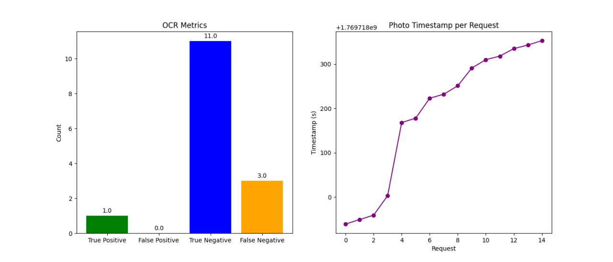

# ESP32 Smart Portal Controller

Проект автоматического управления воротами на базе ESP32 и сервопривода.

## Архитектура
- ESP32S3 (контроллер)
- Flask сервер (FSM + OCR)
- ESP32-CAM (передача изображений)
- Датчик Холла
- Сервопривод 

## Логика работы
1. Датчик Холла срабатывает
2. ESP32 отправляет сигнал на сервер
3. Камера отправляет изображение
4. Сервер распознаёт номер
5. При успехе → шлагбаум открывается

## Используемые технологии
- ESP32 S3
- Python + Flask
- OpenCV + Tesseract OCR
- HTTP / REST

## Эксплуатация 

- PortalController.ino - прошивка для ESP32S3
- python TestTesseract/server_with_real_plate.py для распознавания реальных номеров авто
- python TestTesseract/main.py для тестового режима
## Статус
✅ Проект реализован и протестирован частично. Для распознавания реальных номеров через esp32s3 тестов не проводилось(в разработке).

Таблица результатов тестирования OCR в условиях тестового режима. 

| Metric         |   Value |
|:---------------|--------:|
| True Positive  |       1 |
| False Positive |       0 |
| True Negative  |      11 |
| False Negative |       3 |
| Accuracy (%)   |      80 |

Тестовый режим: в качестве номера авто использовался текст, распечатанный на бумаге. Фото проходили специальную обработку для более точной работы OCR. Программно реализована поддержка только допустимых номеров, в связи с этим показатели метрик OCR нельзя считать объективными. В планах разработчиков улучшить точность работы OCR. 

